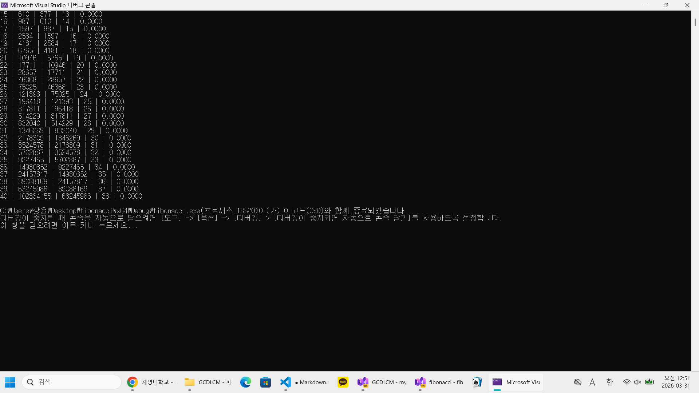

알고리즘 복잡도 분석 및 성능 검증

1. GCD 알고리즘 시간복잡도 분석
본 보고서에서는 최대공약수를 구하는 유클리드 호제법 알고리즘의 효율성을 분석합니다.

시간복잡도 및 Big-O: 유클리드 호제법의 시간복잡도는 O(log n)입니다.

이론적 근거: 두 정수 사이의 나머지 연산을 수행할 때마다 숫자의 크기가 매우 빠르게 감소하며, 연산 횟수는 입력된 숫자의 자릿수에 비례하게 됩니다. 따라서 데이터가 커지더라도 연산량은 매우 완만하게 증가합니다.

2. 피보나치 수열 및 GCD 성능 검증
2.1 피보나치 수열의 시간복잡도
구현 방식: 재귀 호출 방식을 사용하였습니다.

시간복잡도: O(2^n)입니다.

분석: n이 1 증가할 때마다 함수 호출 횟수가 약 2배씩 늘어나는 지수적 증가를 보입니다. 이는 n이 커질수록 CPU 사용량과 실행 시간이 폭발적으로 늘어나는 원인이 됩니다.

2.2 성능 프로파일링 및 검증 결과
n을 5부터 40까지 증가시키며 GCD(F(n), F(n-1))을 계산하는 과정을 통해 각 알고리즘의 성능을 검증하였습니다.

측정 방법: Visual Studio 성능 프로파일러를 사용할 수 없는 환경을 고려하여, time.h 라이브러리의 clock() 함수를 사용하여 성능을 측정하였습니다.

수행 과정: 프로그램의 시작 시점(start)과 종료 시점(end)의 클럭 차이를 구하고, 이를 초 단위로 변환하여 실제 실행 시간을 밀리초(ms) 단위로 산출하였습니다.

GCD의 효율성 검증: n이 40일 때(입력값 약 1억), GCD 연산 횟수는 단 38회에 불과했으며 실행 시간 또한 거의 측정되지 않을 정도로 빨랐습니다. 이는 O(log n) 알고리즘이 최악의 입력 조건에서도 매우 효율적임을 입증합니다.

피보나치의 성능 검토: 반면 재귀 방식으로 구현한 피보나치 값을 구하는 과정은 n이 커짐에 따라 실행 시간이 급격히 길어지는 O(2^n)의 특성을 명확히 보여주었습니다.
